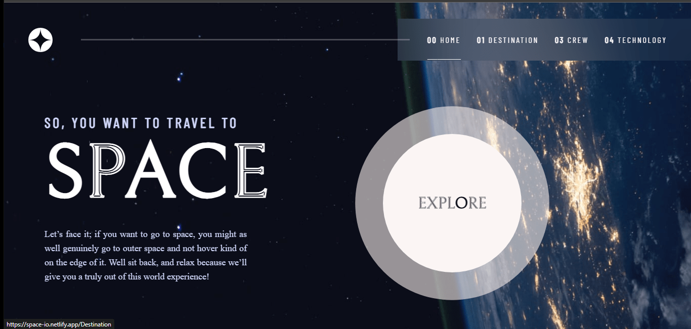

# Space tourism website

### Screenshots

   

   

   

   

### Links

- Live Site URL: [Add live site URL here](https://your-live-site-url.com)

## My process

### Built with

- Semantic HTML5 markup
- CSS custom properties
- Flexbox
- CSS Grid
- Desktop first workflow
- @media queries
- [React](https://reactjs.org/) - JS library

### What I learned

React Router

### Useful resources

- [React resource 1](https://scrimba.com/learn/learnreact) 
- [React resource 2](https://www.youtube.com/c/Codevolution) 

## Contribute
Open to Contributions.

## Author

- Website - [Sagar Sharma](https://sagar-io.github.io/)
